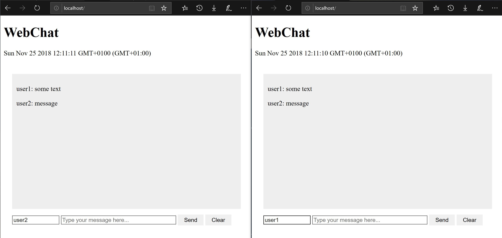

# WebChat

This is a simple Chat application for demonstration purposes of full duplex client-server communication using **node.js**, **Express**, **Websockets** and **MySQL**.
The node.js server starts a HTTP Webserver, provides Websocket services and saves the chat history in a MySQL database.

## Setup
1. install node.js on the server
2. install and start a MySQL Server
  - e.g. https://dev.mysql.com/downloads/mysql/
  - standard password is _root_
  - ATTENTION: use the old authentification method since the new one is not supported in the node.js framework
3. install node.js packages
  ```
  cd <PROJECT_DIR>
  npm install
  ```
4. start server
  ```
  node <PROJECT_DIR>\server.js
  ```
5. open multiple instances of the Website in a browser (_http://localhost_)

## Running Application

